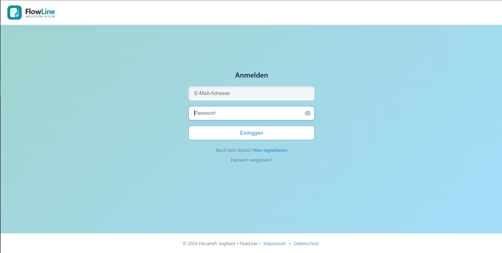
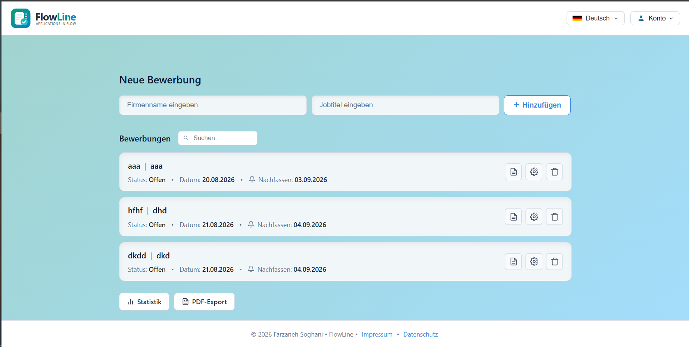

# <p align="left">
  
  <span style="font-size: 26px; font-weight: bold;">FlowLine</span><br>
  <span style="font-size: 10px; color: #8b949e;">Applications in Flow</span>
  </p>

# FlowLine – Job Application Tracker

## 🌐 Live Demo

[](https://farzaneh-soghani-flowline.onrender.com)  

## Bewerbungsverwaltung im Überblick

**FlowLine** ist eine moderne, sichere Full-Stack-Webanwendung, die entwickelt wurde, um den Prozess von Jobbewerbungen effizient zu verwalten, Nachfasstermine im Blick zu behalten und Statistiken übersichtlich darzustellen.  
📱 **Unterwegs? KEIN Problem!** Responsiv für **Handy + Desktop** - deine Bewerbungen immer dabei! 🚀  
> **Im Handy oder Desktop direkt im Browser eingeben: [(https://farzaneh-soghani-flowline.onrender.com)](https://farzaneh-soghani-flowline.onrender.com)**

---
## 🌟 Features & Funktionen

- **Authentifizierung & Sicherheit:** Sichere Registrierung, Login und Token-basierte Passwort-Wiederherstellung.
- **Bewerbungsverwaltung (CRUD):** 
  - Flexibles Verwalten von Bewerbungen (Firma, Position, Status, Datum) inklusive persönlicher Notizen.
  - **Smart Defaults:** Automatische Erfassung des Datums und intelligente 14-Tage-Voreinstellung für Follow-ups (in der Bearbeitungsansicht jedoch jederzeit **manuell und individuell anpassbar**).
- **Übersicht & Statistiken:** 
  - Echtzeit-Suche zum schnellen Finden von Einträgen.
  - Dedizierte Statistik-Ansicht (`/stats`) für offene Bewerbungen und Quoten.
- **Export & Mehrsprachigkeit:** 
  - Direkter PDF-Export (mit ReportLab) im Arbeitsspeicher.
  - Volle Mehrsprachigkeit (i18n) dank Flask-Babel.
- **Design:** 
  - Responsive Layout (Custom CSS & Flexbox) für alle Endgeräte.

---

## 🔒 Sicherheit, Datenschutz & Benutzerfreundlichkeit
* **Datenschutz & Transparenz:** Die Anwendung respektiert die Privatsphäre der Nutzer. Alle Datenschutzbestimmungen und rechtlichen Hinweise sind transparent in der App hinterlegt (`/datenschutz` und `/impressum`).
* **Selbstverwaltung des Kontos:** Benutzer haben die volle Kontrolle über ihre Daten und können ihren Account sowie ihre Einträge jederzeit sicher verwalten.
* **Sichere Passwort-Wiederherstellung via Brevo:** Falls ein Nutzer sein Passwort vergisst, wird über einen sicheren, zeitlich begrenzten Token (`itsdangerous`) und die professionelle **Brevo-E-Mail-API ** zuverlässig ein Wiederherstellungslink versendet.

---

## 🗄️ Datenbank-Architektur & Flexibilität
* **Umgebungsspezifische Datenbanken:** 
  * **Lokale Entwicklung:** Verwendet leichtgewichtige und unkomplizierte **SQLite**-Datenbanken (`sqlite:///flowline.db`).
  * **Production (Neon Serverless PostgreSQL):** Nutzt ein robustes, Cloud-basiertes PostgreSQL-Backend. Die Anwendung erkennt automatisch die Umgebungsvariable `DATABASE_URL` und passt die Verbindung nahtlos an.
  * *Warum Neon?* Im Gegensatz zu klassischen kostenlosen Cloud-Speichern (die oft Daten löschen oder strikte Limits haben) setzt Neon auf eine **Serverless-Architektur mit "Scale-to-Zero" (Auto-Suspend)**. Das bedeutet: Wenn die Datenbank nicht genutzt wird, geht sie in den Ruhe-Modus (schläft ein), um Ressourcen zu sparen, behält aber alle Daten dauerhaft bei. Bei der ersten neuen Anfrage (Request) wacht sie automatisch innerhalb von Sekunden wieder auf (`Wake-up`). Das garantiert dauerhafte **Persistenz** und volle Transparenz für den Betrieb.

---

## 📐 Architektur & Design-Pattern

FlowLine folgt einer **monolithischen Full-Stack-Architektur mit Server-Side Rendering (SSR)** und einer strukturierten, geschichteten Web-Architektur (Layered & Modular Architecture):

* **Routing & Controller:** Strukturierte Flask-Routen zur Verarbeitung von Benutzeranfragen und Steuerung der Logik.
* **Model & ORM:** Verwendung von SQLAlchemy für die objektorientierte und sichere Datenbank-Anbindung (`db.Model`).
* **View & UI:** Dynamische Darstellung über Jinja2 Templates und CSS.
* **Service-Integrationen:** Entkoppelte Dienste wie die Brevo API für den E-Mail-Versand und ReportLab für die PDF-Erstellung im Arbeitsspeicher.

---

## 🛠️ Verwendete Technologien (Tech Stack)
* **Backend:** Python, Flask, Flask-SQLAlchemy, Flask-Login, Flask-Mail, Flask-Babel, Itsdangerous, Werkzeug (Passwort-Hashing mit `scrypt`)
* **Datenbank:** SQLite (für die lokale Entwicklung) / PostgreSQL über **Neon (Serverless Cloud für die Production-Umgebung)**
* **E-Mail-Dienst:** 
  * *Entwicklung:* Gmail SMTP (TLS/SSL)
  * *Production:* Brevo API  (E-Mail-Versand HTTP-basiert, um blockierte SMTP-Ports in der Render-Service-Umgebung zu umgehen)
* **Frontend:** HTML5, CSS3, Jinja2 Templates, Alpine.js (interaktive UI & Sprachumschalter mit Flaggen), SVG-Grafiken & Splash-Screen.
* **Datenbank:** SQLite / PostgreSQL
* **PDF-Generierung:** ReportLab (`io.BytesIO`)
* **Testing & DevOps:** Render (Cloud-Hosting), GitHub Actions (CI/CD), Pytest

---

## 📥 Installation & Lokale Ausführung

Sie können das Repository direkt klonen: [https://github.com/farzaneh-soghani/flowline.git](https://github.com/farzaneh-soghani/flowline.git)  
### Option 1: Klassische Ausführung (Manuell mit Python)
Führen Sie die folgenden Befehle nacheinander in Ihrem Terminal aus:  
```bash
cd flowline
python -m venv .venv
.venv\Scripts\activate
pip install -r requirements.txt
python app.py
```
Hinweis: Öffnen Sie anschließend Ihren Browser unter http://127.0.0.1:5000  

### Option 2: Containerisierte Ausführung (Empfohlen mit Docker)  
Das Projekt ist vollständig containerisiert und kann unkompliziert mit Docker und Docker Compose ausgeführt werden.  

1. **Umgebungsvariablen konfigurieren (.env):**
Erstellen Sie eine .env-Datei im Hauptverzeichnis basierend auf der .env.example und tragen Sie die erforderlichen Konfigurationswerte ein.

2. **Container starten:**
Führen Sie den folgenden Befehl aus:  
```bash
docker compose up --build  
```  

### 🚀 Docker Hub Image

Das fertige Docker-Image wurde erfolgreich auf Docker Hub veröffentlicht und kann direkt bezogen werden:

[](https://hub.docker.com/r/farzaneh0101/flowline)  
```bash
docker pull farzaneh0101/flowline:latest
```

### Enthaltene Dienste bei Docker:  
* **Web-Applikation:** Läuft im Container und stellt die Flask-Anwendung bereit.

* **Datenbank:** Eine isolierte PostgreSQL-Instanz für die Datenspeicherung.

* **CloudBeaver:** Ein Web-Datenbankmanager, der über Port 8978 erreichbar ist, um die Datenbank bequem grafisch zu verwalten.

## 📸 Screenshots

Hier sind einige Einblicke in die FlowLine-Anwendung:

* **Anmeldeseite (Login):**
  

* **Haupt-Dashboard (Übersicht):**
  

* **Bewerbung bearbeiten (Edit):**
  

* **Notizen-Bereich (Notizen):**
  

* **Mobile Ansicht (Responsive):**
  

* **Visuelle Statistiken:**
  


## 📁 Projektstruktur

**Auflistung der Ordnerpfade**  
*(Automatisch generiert mit `tree /f` command)*  

```text
flowline/
│
├── app.py                  # Flask Backend & Hauptanwendung
├── requirements.txt        # Python-Abhängigkeiten
├── Procfile                # Render Deployment Konfiguration
│
├── .github/
│   └── workflows/
│       └── ci.yml          # GitHub Actions CI/CD Pipeline
│
├── static/                 # Statische Dateien (CSS, JS, Bilder)
├── templates/              # HTML / Jinja2 Templates (inkl. i18n, Impressum, Login)
├── translations/           # Mehrsprachigkeits-Dateien (i18n)
├── instance/               # Lokale Datenbank (SQLite)
├── screenshots/            # Anwendungs-Vorschaubilder
├── tests/                  # Automatisierte Pytest-Tests
│   └── test_app.py
│
└── .env                    # Umgebungsvariablen (lokal)
```
## 📈 Projekthistorie & Evolution

* **🚀 FlowLine(v1.0):** Cloud-Hosting auf Render, PostgreSQL und erweiterte Features.
* **📂 Job-Tracker(MVP):** Den ursprünglichen Code und den ersten Prototypen finden Sie im Branch [`Job-Tracker`](https://github.com/farzaneh-soghani/flowline/tree/v1-Job-Tracker).

---
<p align="center">
  <b>Mit Leidenschaft entwickelt in Hamburg</b> • 
  <a href="https://www.linkedin.com/in/farzaneh-soghani/">LinkedIn</a>
</p>
