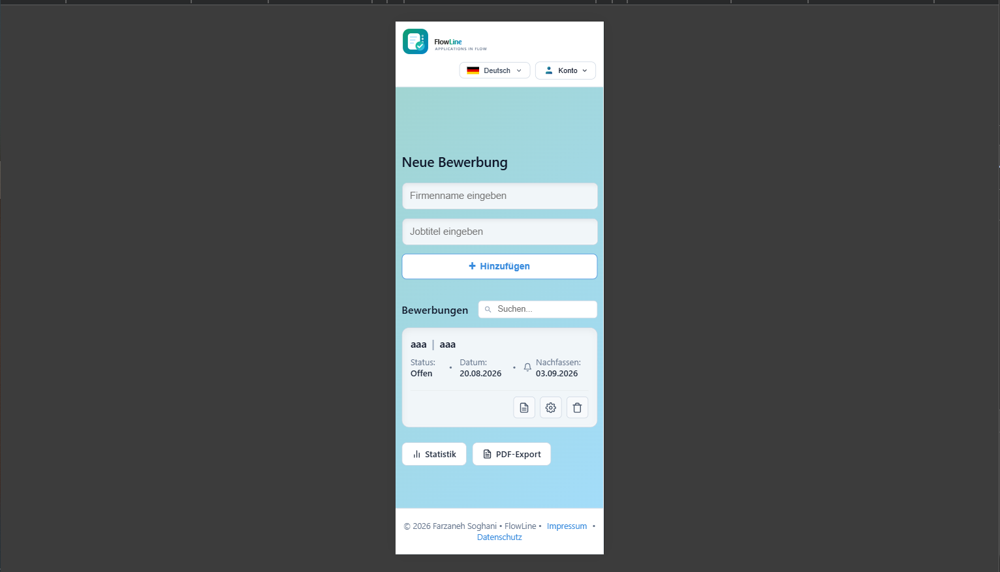
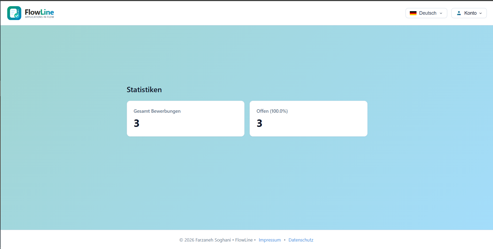
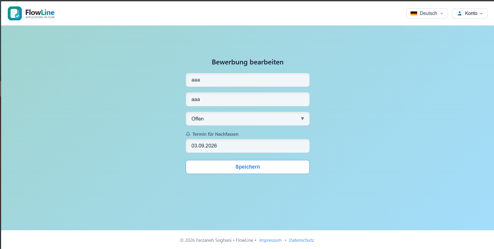
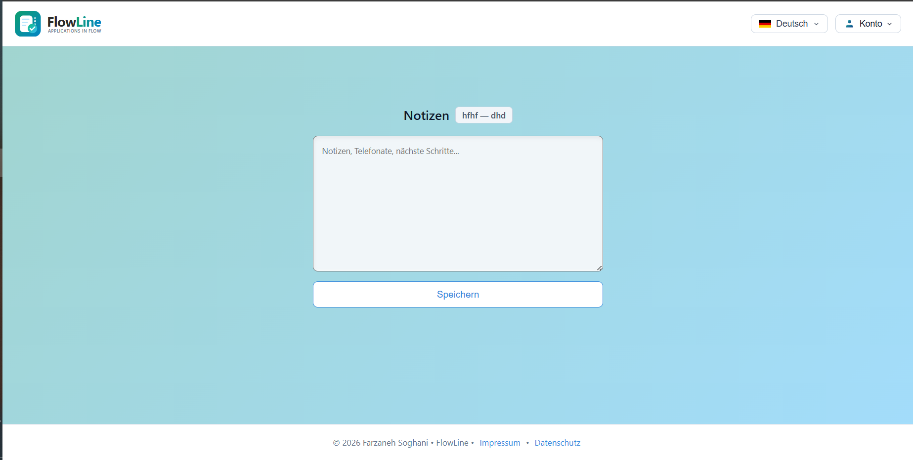

# <p align="left">
  
  <span style="font-size: 26px; font-weight: bold;">FlowLine</span><br>
  <span style="font-size: 10px; color: #8b949e;">Applications in Flow</span>
  </p>

## Bewerbungsverwaltung im Überblick  

## 🌐 Live Demo

[](https://farzaneh-soghani-flowline.onrender.com)  

📱 **Unterwegs? KEIN Problem!** Responsiv für **Handy + Desktop** - deine Bewerbungen immer dabei! 🚀  
> **Im Handy oder Desktop direkt im Browser eingeben: [(https://farzaneh-soghani-flowline.onrender.com)](https://farzaneh-soghani-flowline.onrender.com)**

# FlowLine – Job Application Tracker

**FlowLine** ist eine moderne, sichere Full-Stack-Webanwendung, die entwickelt wurde, um den Prozess von Jobbewerbungen effizient zu verwalten, Nachfasstermine im Blick zu behalten und Statistiken übersichtlich darzustellen.

---

## 📌 Features & Funktionen
* **Sichere Benutzerauthentifizierung:** Registrierung, Login und Passwort-Wiederherstellung (über sichere Token und E-Mail-Versand).
* **Erweiterte Bewerbungsverwaltung (CRUD):** 
  * Flexibles Hinzufügen, Bearbeiten, Löschen von Bewerbungen (Firma, Position, Status, Datum, Follow-up).
  * Hinzufügen und Verwalten von persönlichen Notizen zu jeder Bewerbung.
* **Smart Defaults & Automatische Datumserfassung:** 
  * Das Erstellungsdatum wird automatisch erfasst.
  * Das Nachfass-Datum (Follow-up) wird standardmäßig automatisch auf **genau 2 Wochen (14 Tage)** in die Zukunft gesetzt, kann aber in der Bearbeitungsansicht individuell angepasst werden.
* **Intelligentes Erinnerungssystem:** Automatische Markierung von anstehenden Follow-ups und Nachfass-Aktionen für aktive Bewerbungen (`offen`, `einladung`).
* **Echtzeit-Statistiken:** Eine dedizierte Statistik-Ansicht (`/stats`) zeigt die Gesamtanzahl sowie den prozentualen Anteil der noch offenen Bewerbungen.
* **PDF-Export:** Generierung von professionellen Bewerbungsübersichten als PDF direkt im Arbeitsspeicher (mit ReportLab).
* **Mehrsprachigkeit (i18n):** Unterstützt mehrere Sprachen (Deutsch, Englisch, Persisch, Arabisch, Türkisch, etc.) dank Flask-Babel.
* **Vollständig Responsive:** Optimiertes Layout für alle Endgeräte (Desktop, Tablets und Smartphones) dank modernem Bootstrap-Design.
* **Automatisierte CI/CD-Pipelines & Hosting:** Automatische Ausführung aller Tests über GitHub Actions und nahtloses Hosting auf **Render**.

---

## 🔒 Sicherheit, Datenschutz & Benutzerfreundlichkeit
* **Datenschutz & Transparenz:** Die Anwendung respektiert die Privatsphäre der Nutzer. Alle Datenschutzbestimmungen und rechtlichen Hinweise sind transparent in der App hinterlegt (`/datenschutz` und `/impressum`).
* **Selbstverwaltung des Kontos:** Benutzer haben die volle Kontrolle über ihre Daten und können ihren Account sowie ihre Einträge jederzeit sicher verwalten.
* **Sichere Passwort-Wiederherstellung via Brevo:** Falls ein Nutzer sein Passwort vergisst, wird über einen sicheren, zeitlich begrenzten Token (`itsdangerous`) und die professionelle **Brevo-E-Mail-API / SMTP** zuverlässig ein Wiederherstellungslink versendet.

---

## 🗄️ Datenbank-Architektur & Flexibilität
* **Umgebungsspezifische Datenbanken:** 
  * **Lokale Entwicklung:** Verwendet leichtgewichtige und unkomplizierte **SQLite**-Datenbanken (`sqlite:///flowline.db`).
  * **Production (Render):** Nutzt ein robustes **PostgreSQL**-Backend. Die Anwendung erkennt automatisch die Umgebungsvariable `DATABASE_URL` und passt die Verbindung nahtlos an.

---

## 📐 Architektur & Design-Pattern
FlowLine folgt einer **modularen und geschichteten Web-Architektur (Layered & Modular Architecture)**, die optimal auf die Anforderungen moderner Full-Stack-Anwendungen abgestimmt ist:
* **Routing & Controller:** Strukturierte Flask-Routen zur Verarbeitung von Benutzeranfragen und Steuerung der Logik.
* **Model & ORM:** Verwendung von **SQLAlchemy** für die objektorientierte und sichere Datenbank-Anbindung.
* **View & UI:** Dynamische Darstellung über **Jinja2** Templates und **Bootstrap** (Responsive Design).
* **Service-Integrationen:** Entkoppelte Dienste wie die **Brevo API** für den E-Mail-Versand und **ReportLab** für die PDF-Erstellung im Arbeitsspeicher.

---

## 🛠️ Verwendete Technologien (Tech Stack)
* **Backend:** Python, Flask, Flask-SQLAlchemy, Flask-Login, Flask-Mail, Flask-Babel, Itsdangerous, Werkzeug (Passwort-Hashing mit `scrypt`)
* **E-Mail-Dienst:** 
  * *Entwicklung:* Gmail SMTP (TLS/SSL)
  * *Production:* Brevo API / SMTP (für zuverlässigen Transaktions-E-Mail-Versand)
* **Frontend:** HTML5, CSS3, (Responsive Design), Jinja2 Templates
* **Datenbank:** SQLite / PostgreSQL
* **PDF-Generierung:** ReportLab (`io.BytesIO`)
* **Testing & DevOps:** Render (Cloud-Hosting), GitHub Actions (CI/CD), Pytest

---

## ⚙️ Installation & Lokale Ausführung

Falls Sie das Projekt lokal testen möchten, folgen Sie diesen Schritten:

1. **Repository klonen:**
   ```bash
   git clone [https://github.com/farzaneh-soghani/flowline.git](https://github.com/farzaneh-soghani/flowline.git)
   cd flowline


## 📸 Screenshots  

**Desktop Dashboard**  

  
  **Mobile Dashboard**  
  
  
  **Statistics**  

  
  **Edit Form**  
  
  
  **Notizen**  
  


## 📁 Projektstruktur

**Auflistung der Ordnerpfade**  
*(Automatisch generiert mit `tree /f` command)*  

```txt
C:.
│
├── app.py # Flask Backend + Bewerbungslogik
├── requirements.txt # Flask 3.0.3 + pytest 7.4.0 + gunicorn
├── Procfile # Render Deployment
├── pytest.ini # Test-Konfiguration
├── struktur.txt # Lokale Projektnotizen
│
├── .github/
│ └── workflows/
│ └── ci.yml # GitHub Actions CI/CD
│
├── templates/ # HTML/Jinja2 Templates
│ ├── index.html
│ ├── stats.html
│ ├── edit.html
│ └── notes.html
│
└── tests/
└── test_app.py # pytest Unit-Tests
```  

**💼 Made with ❤️ in Hamburg | [🔗 LinkedIn](https://www.linkedin.com/in/farzaneh-soghani/)**
